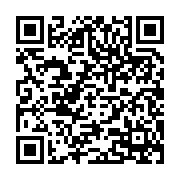

# VSS 2026 Schedule Organizer

A React Native mobile app for iOS and Android to search and organize your Vision Sciences Society conference schedule, May 15–19, 2026, St. Petersburg Beach, FL.

## For Conference Attendees

**No account or setup required.** Install the free Expo Go app and scan the QR code below.



**iPhone:** Open the Camera app → point at the QR code → tap the notification → opens in Expo Go automatically.

**Android:** Install Expo Go → tap **Scan QR Code** → point at the QR code.

---

## Features

- **1,191 presentations** from the official VSS 2026 Abstracts PDF
- Full-text search by title, author, abstract, and affiliation
- Filter by day (Fri–Tue) and type (Talk / Poster / Symposium)
- **Tap any card** to read the full abstract, authors, and session details in a pop-up sheet
- Build a personal schedule — add/remove directly from the detail sheet
- Export to **Google Calendar** (opens in browser) or **Apple Calendar** (adds events directly, no alarms set)
- **Google Calendar users:** disable default reminders in Google Calendar settings to avoid repeated alerts during the conference
- Persistent schedule — survives app restarts
- Works offline after first load

---

## For Developers

### Quick Start

```bash
git clone https://github.com/markwgreenlee/vss-2026-scheduler.git
cd vss-2026-scheduler
npm install
npx expo start
```

Scan the QR code from the terminal with your phone (same iOS/Android instructions as above).

### Building a Standalone App

To distribute without requiring Expo Go:

```bash
eas build --platform android   # produces .apk / .aab — requires free Expo account
eas build --platform ios       # produces .ipa — requires Apple Developer account ($99/yr)
```

### Project Structure

```
vss-mobile/
├── App.js                          # Entry point, tab navigation
├── app.json                        # Expo / EAS configuration
├── assets/
│   └── vss-data.json               # 1,156 presentations
├── src/
│   ├── screens/
│   │   ├── SearchScreen.js         # Search & filter
│   │   ├── ScheduleScreen.js       # My schedule & export
│   │   └── SettingsScreen.js       # App info
│   ├── components/
│   │   ├── SessionCard.js          # Presentation card
│   │   ├── SelectedSessionCard.js  # Selected item card
│   │   └── ExportButton.js         # Calendar export buttons
│   └── context/
│       └── DataContext.js          # Global state & search logic
```

### Tech Stack

- React Native 0.76 / React 19
- Expo SDK 54
- expo-calendar (direct Apple Calendar event creation)
- AsyncStorage (persistent schedule)
- EAS Update (OTA publishing via Expo Go)

---

## Version History

**v1.1.0** (2026-05-10)
- Replaced 190-record dataset with full 1,156 presentations from official VSS HTML scheduler
- Chip-style day/type filters replacing picker wheels
- Apple Calendar export now adds events directly (no .ics file)
- Published via EAS Update — scannable QR code, no dev server needed

**v1.0.0** (2026-05-08)
- Initial release

---

## Data Source & Attribution

Presentation data is sourced from the **official VSS 2026 Abstracts PDF** published by the Vision Sciences Society. This app was inspired by [MiYoung Kwon's](https://kwonlab.psych.umn.edu) HTML conference scheduler, which she generously shared with the community.

## Support

- **VSS website:** https://www.visionsciences.org
- **GitHub:** https://github.com/markwgreenlee/vss-2026-scheduler
- **Issues:** Open a GitHub issue

---

VSS 2026 | May 15–19, 2026 | St. Petersburg Beach, FL
