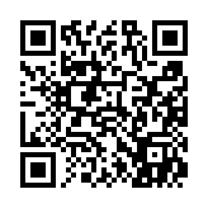

# VSS 2026 Schedule Organizer

A React Native mobile app for iOS and Android to search and organize your Vision Sciences Society conference schedule, May 15–19, 2026, St. Petersburg Beach, FL.

## For Conference Attendees

**Two ways to access the app — choose either:**

### Option 1: Web version (simplest — no installation required)

Open in any phone browser by scanning this QR code:



Or go directly to: **https://markwgreenlee.github.io/vss-2026-scheduler**

Works on any iPhone or Android. No app installation needed. Google Calendar export works; Apple Calendar export is not available in the browser version.

### Option 2: Expo Go app (full features including Apple Calendar)

**No account or setup required.** Install the free [Expo Go](https://expo.dev/expo-go) app and scan the QR code below. **No need to open it** — just scan the QR code with your phone's camera.


**iPhone:** Open the Camera app → point at the QR code → tap the notification → opens in Expo Go automatically.

**Android:** Install Expo Go → tap the **QR code icon** (bottom right) → point at the QR code.

**No login needed:** If Expo Go asks you to log in, skip it — just use your phone's camera to scan the QR code directly.

Works online and offline after the first load.

> **Beta:** This is a community-built tool. Data is sourced from the official VSS 2026 Abstracts PDF; known extraction errors have been corrected, but some inaccuracies may remain. Feedback and corrections welcome — open a [GitHub issue](https://github.com/markwgreenlee/vss-2026-scheduler/issues) or email markwgreenlee@gmail.com.

---

## Troubleshooting

**Most users won't need this section.** The app works without any account or setup. If you encounter an issue, try the solutions below.

### Error: "HTTP response error 403" or "this project requires authentication" (rare)

These errors (including "signed-in Expo account does not have access...") all have the same cause: you are signed into Expo Go with a personal Expo account from another project.

**Fix:**
1. In Expo Go, tap your profile icon → **Sign out**
2. Scan the QR code from GitHub again

**Note:** First-time users won't see this — Expo Go starts in anonymous mode by default.

### Message: "Using a cached version of the app" (normal behavior)

**What this means:** When you scan the QR code, Expo Go tries to download the latest version from our servers. If the download is slow or the connection times out, Expo Go automatically uses the version already saved on your phone — this is a safety feature so the app always works.

**You are not looking at an outdated version.** The app and data are current. Each time you open the app, it checks for updates. The message simply means Expo Go couldn't complete the download at that moment and fell back to the cached version, which is fine.

**No action needed** — the app works normally and you have the latest data.

### App won't start

- Force close the app and wait 10 seconds, then reopen
- If it still fails, restart your phone

### Calendar times are wrong

Check that automatic timezone is enabled on your phone:
- **iPhone:** Settings → General → Date & Time → "Set Automatically" ON
- **Android:** Settings → System → Date & Time → "Automatic date/time" ON

Then close and reopen the Calendar app.

### Error: "Could not connect to the server" (exp://192.168.x.x)

**What this means:** You have multiple "VSS 2026 Scheduler" entries in Expo Go's "Recently opened" list. One points to the production app (from the QR code), and one points to a cached local development server that is no longer running.

**Fix — Option 1 (Quick):**
1. In Expo Go, tap the **first/top** "VSS 2026 Scheduler" entry (the production version from the QR code)
2. If you see this error, tap "Go Home" and try the other entry

**Fix — Option 2 (Clean slate):**
1. In Expo Go home screen, tap **CLEAR** in the "Recently opened" section
2. Scan the QR code from GitHub again to start fresh

**To clean up:** You can also uninstall and reinstall Expo Go to clear the cache entirely.

### Can't find presentations

- Try shorter search terms (e.g., "vision" instead of "visual neuroscience")
- Search by author last name (e.g., "Smith", "Jones")
- Check that day and type filters are set to "All"
- Close and reopen the app to verify all 1,191 presentations loaded

---

## Features

- **1,191 presentations** from the official VSS 2026 Abstracts PDF
- Full-text search by title, author, abstract, and affiliation
- Filter by day (Fri–Tue) and type (Talk / Poster / Symposium)
- **Tap any card** to read the full abstract, authors, and session details in a pop-up sheet
- Build a personal schedule — add/remove directly from the detail sheet
- Export to **Google Calendar** (opens in browser) or **Apple Calendar** (adds events directly, no alarms set) — each event is 15 minutes (individual presentation duration, not full session)
- **Google Calendar users:** disable default reminders in Google Calendar settings to avoid repeated alerts during the conference
- Persistent schedule — survives app restarts
- Works offline after first load

---

## For Developers

### Quick Start

```bash
git clone https://github.com/markwgreenlee/vss-2026-scheduler.git
cd vss-2026-scheduler
npm install
npx expo start
```

Scan the QR code from the terminal with your phone (same iOS/Android instructions as above).

### Building a Standalone App

To distribute without requiring Expo Go:

```bash
eas build --platform android   # produces .apk / .aab — requires free Expo account
eas build --platform ios       # produces .ipa — requires Apple Developer account ($99/yr)
```

### Project Structure

```
vss-mobile/
├── App.js                          # Entry point, tab navigation
├── app.json                        # Expo / EAS configuration
├── assets/
│   └── vss-data.json               # 1,191 presentations
├── src/
│   ├── screens/
│   │   ├── SearchScreen.js         # Search & filter
│   │   ├── ScheduleScreen.js       # My schedule & export
│   │   └── SettingsScreen.js       # App info & attribution
│   ├── components/
│   │   ├── SessionCard.js          # Presentation card
│   │   ├── SelectedSessionCard.js  # Selected item card
│   │   ├── SessionDetailModal.js   # Full abstract / detail sheet
│   │   └── ExportButton.js         # Calendar export buttons
│   └── context/
│       └── DataContext.js          # Global state & search logic
```

### Tech Stack

- React Native 0.76 / React 19
- Expo SDK 54
- expo-calendar (direct Apple Calendar event creation)
- AsyncStorage (persistent schedule)
- EAS Update (OTA publishing via Expo Go)

### Environment Variables

This project follows Expo best practices for environment variable visibility:

**Public variables** (prefixed with `EXPO_PUBLIC_`) are safe to expose in client code:
```
EXPO_PUBLIC_APP_NAME=VSS 2026 Schedule Organizer
EXPO_PUBLIC_VSS_YEAR=2026
EXPO_PUBLIC_TOTAL_PRESENTATIONS=1191
```

**Secret variables** (no prefix) are kept private and only available on EAS servers:
- API keys, authentication tokens, and other sensitive data should use secret visibility
- Not readable locally or in JavaScript code

**For local development:**
1. Copy or create `.env.local` with public variables
2. Access via `src/config/environment.js`
3. Secret env variables can be set in your [Expo Dashboard](https://expo.dev)

---

## Version History

**v1.5.0** (2026-05-15)
- Web version launched at https://markwgreenlee.github.io/vss-2026-scheduler — works in any phone browser, no installation required
- Google Calendar export available in web version; Apple Calendar export requires the Expo Go app
- Deployed via GitHub Pages

**v1.4.0** (2026-05-14)
- Calendar export for **talks** now uses 15-minute presentation duration instead of full session duration — fixes overlap issues when multiple talks from the same session are added to the calendar
- **Talks** appear with accurate 15-minute duration across Google Calendar and Apple Calendar (posters and symposia retain full session duration since individual presentation times are not specified in the VSS program)
- Resolves iOS Calendar display issue where overlapping talk events were difficult to interact with

**v1.3.0** (2026-05-13)
- Poster number (e.g. 26.401) shown before title in all cards and detail sheet — essential for locating a poster board
- Removing a presentation now offers to also delete the matching Apple Calendar event
- Apple Calendar export detects duplicate presentations before creating events — skip, add anyway, or cancel
- Calendar export timezone fixed: all events anchor to Eastern Daylight Time (Florida) regardless of where the user is located

**v1.2.0** (2026-05-13)
- Dataset grown to 1,191 presentations with 150+ data quality corrections (abstracts, authors, affiliations)
- Author affiliation superscripts now displayed in the detail sheet
- Data source updated to official VSS 2026 Abstracts PDF; MiYoung Kwon's HTML scheduler credited as inspiration
- Personal data removed from dataset; beta disclaimer added

**v1.1.0** (2026-05-10)
- Replaced 190-record dataset with full 1,156 presentations
- Chip-style day/type filters replacing picker wheels
- Apple Calendar export now adds events directly (no .ics file)
- Published via EAS Update — scannable QR code, no dev server needed

**v1.0.0** (2026-05-08)
- Initial release

---

## Data Source & Attribution

Presentation data is sourced from the **official VSS 2026 Abstracts PDF** published by the Vision Sciences Society. This app was inspired by [MiYoung Kwon's](https://kwonlab.psych.umn.edu) HTML conference scheduler, which she generously shared with the community.

## Support

- **VSS website:** https://www.visionsciences.org
- **GitHub:** https://github.com/markwgreenlee/vss-2026-scheduler
- **Issues:** Open a GitHub issue

---

VSS 2026 | May 15–19, 2026 | St. Petersburg Beach, FL
